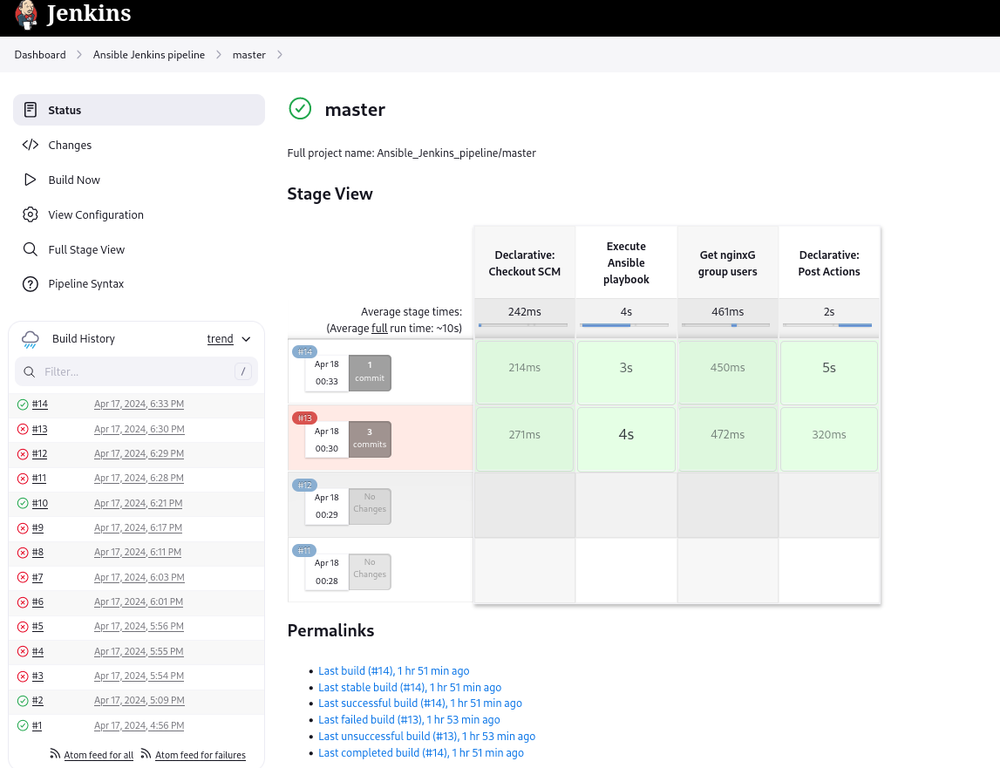
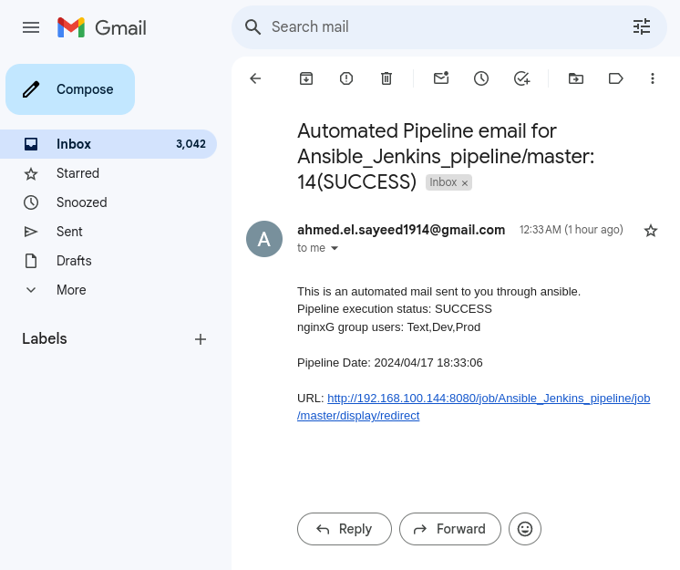
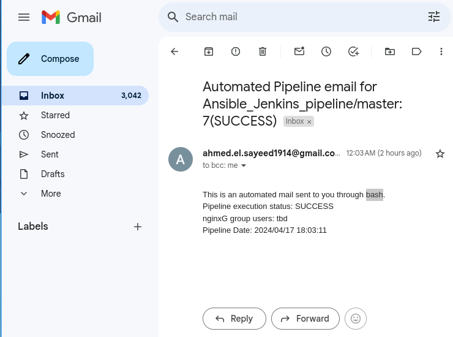
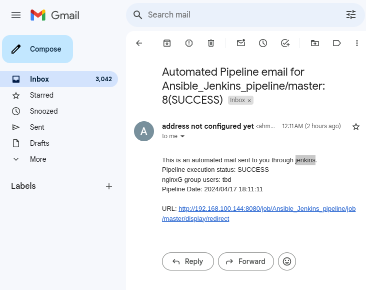
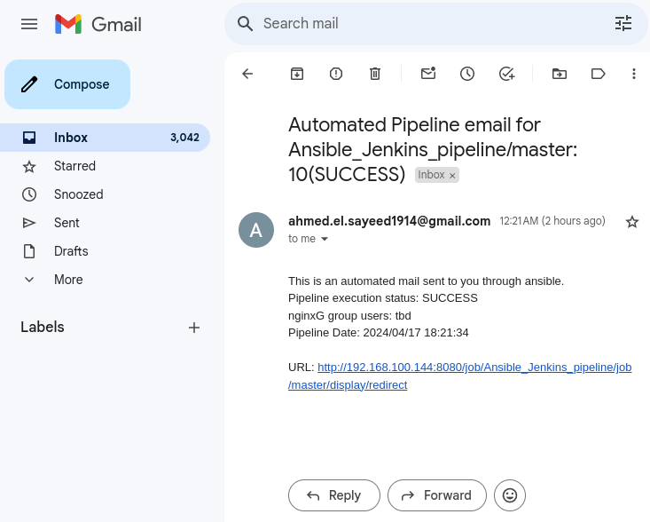
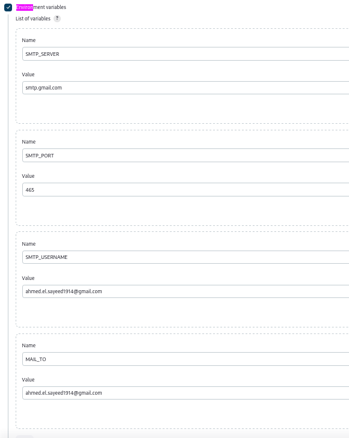
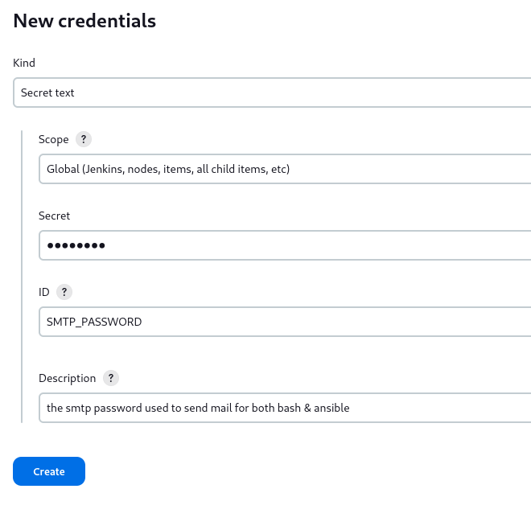
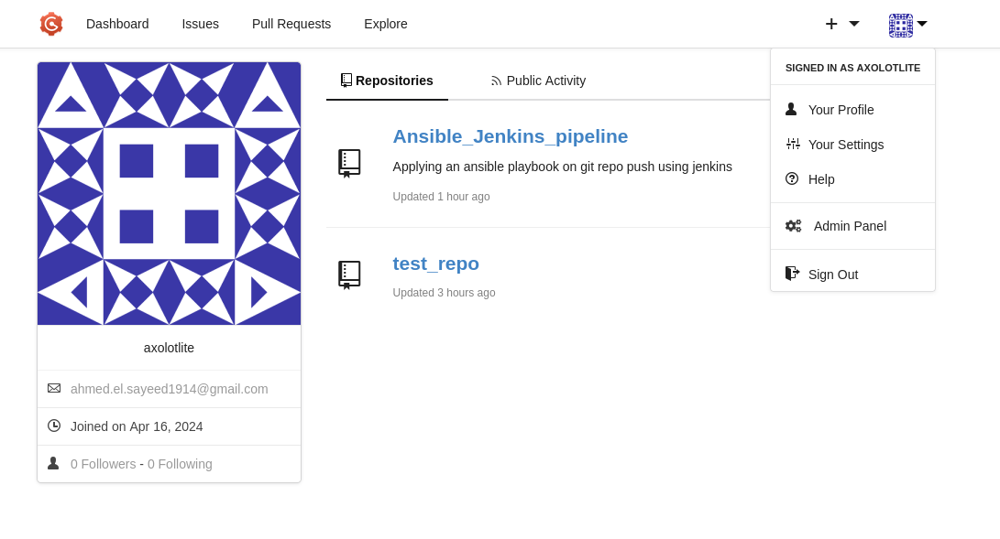
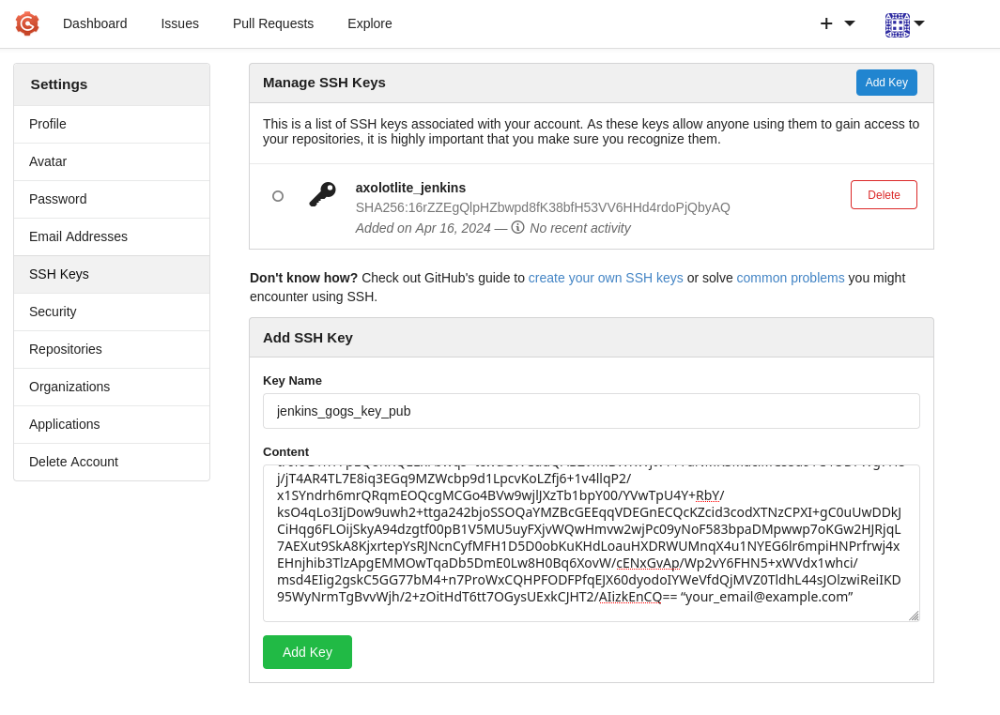
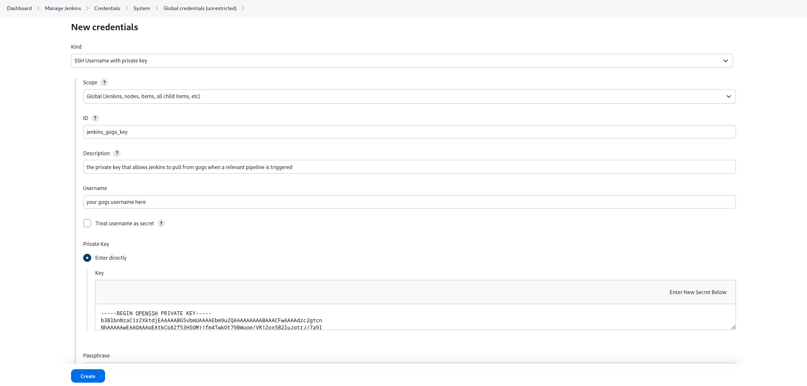

# Ansible Jenkins pipeline
This project relies on 3 Virtual Machines, 2 VMs hosting jenkins and gogs with them integrating using web-hooks and ssh keys and a 3rd VM on which the **Jenkinsfile** hosted on the gogs repo, will run in a jenkins pipeline whose end goal is to install nginx, check users in the **nginxG** group, then send an email with all the associated pipeline info.

## Jenkinsfile Explanation
there are 2 stages:
1) Execute Ansible playbook: which as the name suggests, executes the `InstallNginx.yml`. Originally I had the nginx role in the `main.yml` which would run with the `nginx` tag to execute it. (this requires ansible to be installed on the jenkins host and ansible jenkins-plugin )
2) Get nginxG group members: this uses sshagent to remotely execute the local bash script `GroupMembers.sh` which in turn parses through the `/etc/group` file to get the users in the `nginxG` group, then stores them into a scoped variable called `nginxGUsers.`
	This will require an environment variable called `TARGET_HOST` which is either the hostname or the ip address of VM3
```groovy
environment{
	TARGET_HOST="VM3 address"
}
```
finally the post stage will always call the `send_mail` function, with one of three parameters:
- bash: which will call the script `mailto.sh` which uses curl to securely send mail
- jenkins: which will use jenkins notifications setup to send the mail
- ansible: which will call a role in the ansible directory to send the mail
They all depend on environmental variables which could be set locally or globally:
pipeline environmental variable setup(note, you will have to setup `SMTP_PASSWORD` as a **secret text** in jenkins credentials):
```groovy
environment{
	SMTP_SERVER="smtp.gmail.com"
	SMTP_PORT="465"
	SMTP_USERNAME="your_email@example.com"
	SMTP_PASSWORD=credentials("SMTP_PASSWORD")
	MAIL_TO="your_email@example.com"
}
```
global setup is shown [here](#global-environment-variables-for-smtp) in a later section
### pipeline execution images:
last run pipeline

last email containing the mail method, status of the pipeline, nginxG members, date and url

different method pre implementation of group member acquisition



## Pre-Requisites
### Virtual Machine Configurations
This project requires 3 `RockyOS` virtual machines, my configuration is as follows using qemu-kvm / virt-manager:
	subnet: `192.168.1.100/24` 
	domain: `project_net`
	VM1:
		name: `jenkins`
		full hostname: `jenkins.project_net`
		address: `192.168.100.144`	
	VM2:
		name: `gogs`
		full hostname: `gogs.project_net`
		address: `192.168.100.254`
	VM3:
		name: `target`
		full hostname: `target.project_net`
		address: `192.168.100.171`

#### VM1 configuration
Install and enable jenkins
```bash
curl -O https://pkg.jenkins.io/redhat-stable/jenkins.repo --output-dir /etc/yum.repos.d
rpm --import https://pkg.jenkins.io/redhat-stable/jenkins.io-2023.key
dnf -y install jenkins
systemctl enable --now jenkins
```
open the relevant jenkins ports
```
firewall-cmd --add-port=8080/tcp --permanent
firewall-cmd --reload
```

next you will configure jenkins through the GUI, after you're done you will need to install these plugins:
- [Ansible plugin](https://plugins.jenkins.io/ansible)
- [SSH Agent](https://plugins.jenkins.io/ssh-agent)
- [Gogs](https://plugins.jenkins.io/gogs-webhook)

Install git & ansible
```
dnf install epel-release -y
dnf -y install git ansible
```

After this, you'll have to setup jenkins:
##### global environment variables for SMTP
go to `Dashboard -> Manage Jenkins -> System`
then set the following variables

##### google secure app password
follow this url: https://myaccount.google.com/apppasswords
create a new **smtp password** token
then go to: Dashboard -> Manage Jenkins -> Credentials -> System -> Global credentials
from there, add new credentials of type **secret text** with id `SMTP_PASSWORD`


After finishing these two steps, both bash and ansible will be able to send mail to your target address.

VM2 Configuration
Install mariadb & gogs, create a systemd unit file and enable it
first mariadb
```
dnf install mariadb-server
systemctl enable --now mariadb
```
configure it
```
SET GLOBAL innodb_file_per_table = ON;
CREATE DATABASE IF NOT EXISTS gogs CHARACTER SET utf8mb4 COLLATE utf8mb4_general_ci;
GRANT ALL PRIVILEGES ON gogs.* TO 'gogs'@'localhost' IDENTIFIED BY "password";
FLUSH PRIVILEGES;
```
then download gogs and configure it
```
curl -s https://api.github.com/repos/gogs/gogs/releases/latest | grep browser_download_url | grep '\linux_amd64.zip' | cut -d '"' -f 4 | wget -i -
unzip gogs_*_linux_amd64.zip -d /opt/
```
install git
```
dnf -y install git
```
create git user for gogs
```
adduser git
mkdir /var/log/gogs
chown -R git:git /var/log/gogs/
```
open the firewall ports
```
firewall-cmd --zone=public --add-port=3000/tcp --permanent
firewall-cmd --reload
```
download the unit file (tdb)
```
curl -o /usr/lib/systemd/system/gogs.service  repo
```
then append to `[security]` the jenkins VM `ip address` to allow the webhook resolution to work
```
sed -i '/\[security\]/a LOCAL_NETWORK_ALLOWLIST=192.168.100.144' /opt/gogs/custom/conf/app.ini
```
finally enable the gogs service
```
systemctl enable --now gogs.service
```
next you will configure gogs through the GUI

---
### Integrating gogs with jenkins
to allow jenkins to pull repos from gogs, you'll need to setup an ssh key, place the public in your gogs account settings and the private as a secret in jenkins.
First, we start by creating an ssh key
```
ssh-keygen -t rsa -b 4096 -C “your_email@example.com” -q -N "" -f jenkins_gogs_key
```
#### gogs integration
next, we add the public key to your gogs account
first, click on your profile picture in gogs web ui

from there, select `SSH Keys` from the left pane and press `Add Key` then copy the contents of the entire public key `jenkins_gogs_key.pub` into it

#### jenkins integration
then, we add the private key into jenkins credentials
first go to: Dashboard -> Manage Jenkins -> Credentials -> System -> Global credentials
from there, add new credentials of type **SSH Username with private key** with id `jenkins_gogs_key`
use your gogs account username and copy the entire private ssh key `jenkins_gogs_key`

now, in the configuration of any jenkins job you create, specify the ssh credentials you use for your account.


